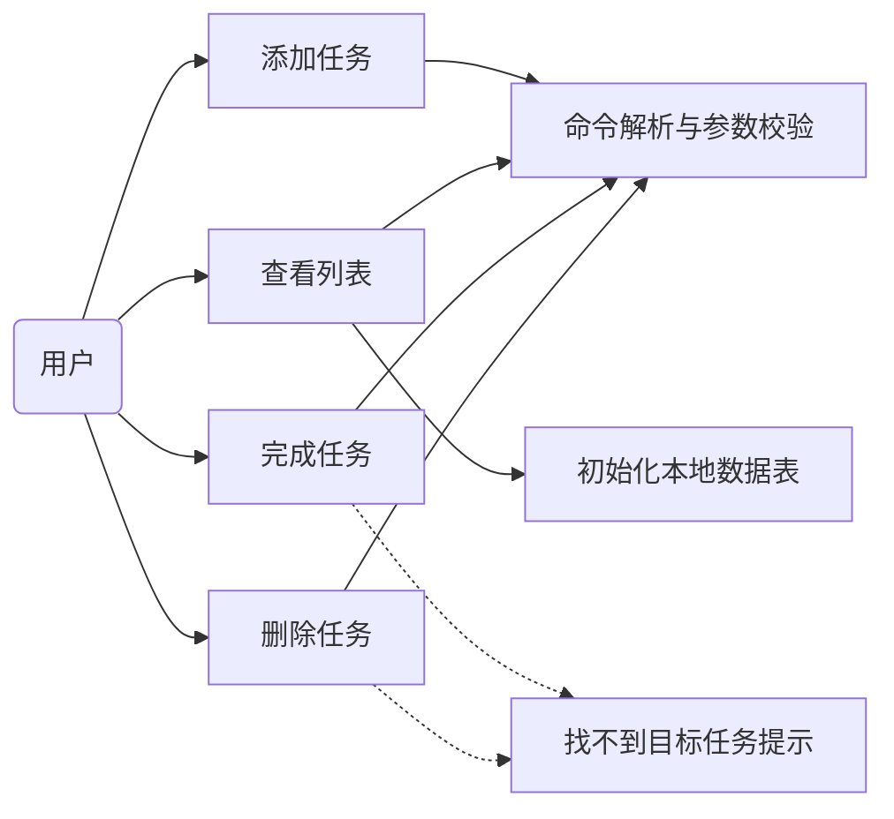
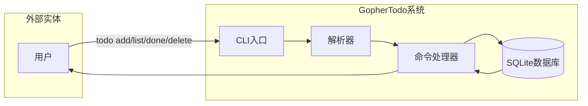
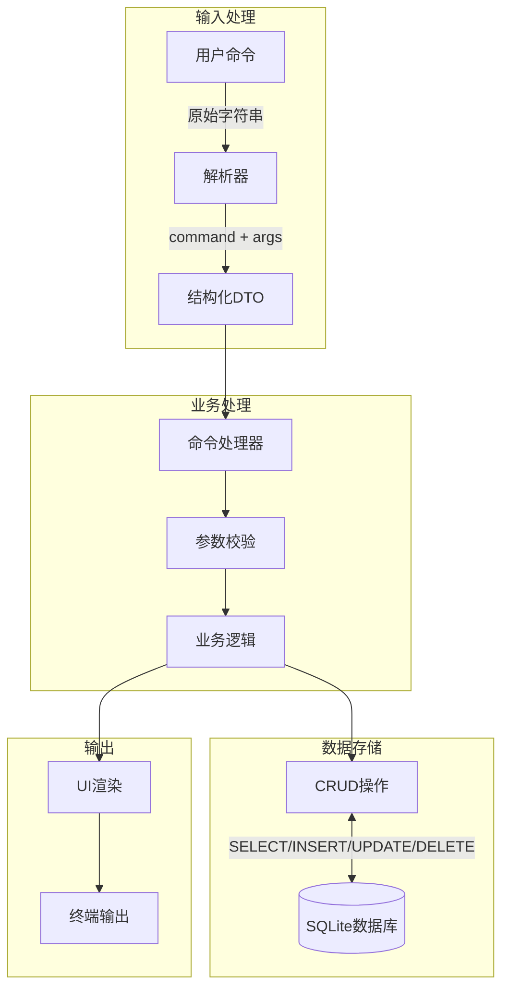
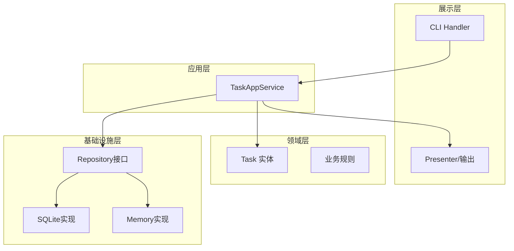

# 需求规格说明书 (SRS) 更新

**项目名称**: GopherTodo CLI  
**团队**: 啥队  
**文档版本**: v3.0  
**更新日期**: 2026-04-09  
**关联阶段**: Sprint 2 - OOA建模评审

---

## 一、文档目的

本文档是GopherTodo项目的需求规格说明书（SRS）更新版本，整合了第四阶段（4-3阶段）利用大语言模型生成的核心业务**用例图（Use Case Diagram）**与**DFD数据流图**，形成完整的需求规格文档。

---

## 二、系统概述

### 2.1 项目背景

GopherTodo是一款面向个人的命令行待办事项管理工具，旨在帮助用户通过简单的终端命令高效管理日常任务。项目采用Scrum敏捷开发流程，使用Golang语言开发，数据存储采用SQLite本地数据库。

### 2.2 系统边界

| 维度 | 范围 |
|------|------|
| **用户类型** | 单机用户 |
| **运行平台** | Windows / macOS / Linux |
| **网络依赖** | 无（离线可用） |
| **并发要求** | 单用户操作 |
| **数据存储** | 本地SQLite (`~/.todo.db`) |

---

## 三、核心业务用例图 (Use Case Diagram)

### 3.1 系统用例图（Mermaid格式）

### 3.2 用例详细说明

| 用例ID | 用例名称 | 参与者 | 描述 |
|--------|---------|--------|------|
| UC-01 | 添加任务 | 用户 | 用户通过`todo add "内容"`添加新任务 |
| UC-02 | 查看列表 | 用户 | 用户通过`todo list`查看所有未完成任务 |
| UC-03 | 完成任务 | 用户 | 用户通过`todo done <ID>`标记任务完成 |
| UC-04 | 删除任务 | 用户 | 用户通过`todo delete <ID>`删除任务 |

### 3.3 用例规约

#### UC-01 添加任务

| 属性 | 内容 |
|------|------|
| **用例ID** | UC-01 |
| **用例名称** | 添加任务 (Add Task) |
| **参与者** | 用户 |
| **前置条件** | 无 |
| **后置条件** | 新任务成功写入数据库 |
| **基本流程** | 1. 用户输入`todo add "任务内容"` 2. 系统解析命令和参数 3. 系统创建新任务记录 4. 系统返回成功提示 |
| **扩展点** | 若内容为空，返回错误提示 |
| **验收标准** | 1. 支持带空格的内容输入 2. 数据库成功插入新记录 3. 命令行返回成功提示 |

#### UC-02 查看列表

| 属性 | 内容 |
|------|------|
| **用例ID** | UC-02 |
| **用例名称** | 查看列表 (List Tasks) |
| **参与者** | 用户 |
| **前置条件** | 数据库存在至少一条记录（首次运行自动初始化表） |
| **后置条件** | 列表清晰展示 |
| **基本流程** | 1. 用户输入`todo list` 2. 系统从数据库读取未完成任务 3. 系统以表格形式输出 |
| **扩展点** | 首次运行时自动初始化数据表 |
| **验收标准** | 1. 列表清晰展示ID、时间、内容 2. 默认仅显示未完成项 3. 无任务时展示友好提示 |

#### UC-03 完成任务

| 属性 | 内容 |
|------|------|
| **用例ID** | UC-03 |
| **用例名称** | 完成任务 (Complete Task) |
| **参与者** | 用户 |
| **前置条件** | 存在指定ID的任务 |
| **后置条件** | 任务状态更新为已完成 |
| **基本流程** | 1. 用户输入`todo done <ID>` 2. 系统解析命令和ID 3. 系统查找并更新任务状态 4. 系统返回成功提示 |
| **扩展点** | 当ID不存在时，显示"未找到对应任务"提示 |
| **验收标准** | 1. 修改对应记录的status字段 2. 命令行反馈任务已完成 |

#### UC-04 删除任务

| 属性 | 内容 |
|------|------|
| **用例ID** | UC-04 |
| **用例名称** | 删除任务 (Delete Task) |
| **参与者** | 用户 |
| **前置条件** | 存在指定ID的任务 |
| **后置条件** | 任务被删除或标记为已删除 |
| **基本流程** | 1. 用户输入`todo delete <ID>` 2. 系统解析命令和ID 3. 系统删除或标记删除记录 4. 系统返回成功提示 |
| **扩展点** | 当ID不存在时，显示"未找到对应任务"提示 |
| **验收标准** | 通过ID物理或逻辑删除记录 |

---

## 四、系统数据流图 (DFD)

### 4.1 顶层数据流图（Context Diagram）

### 4.2 一层数据流图（详细分解）

### 4.3 数据流描述

| 数据流编号 | 名称 | 来源 | 目的地 | 数据内容 |
|-----------|------|------|--------|---------|
| DF-01 | 原始命令 | 用户 | 解析器 | `todo add/list/done/delete [参数]` |
| DF-02 | 命令对象 | 解析器 | 处理器 | `{command, args[]}` |
| DF-03 | 执行结果 | 处理器 | 渲染器 | `{success, message, data}` |
| DF-04 | 用户提示 | 渲染器 | 用户 | 格式化输出文本 |
| DF-05 | 查询请求 | 处理器 | 数据库 | SQL语句 |
| DF-06 | 查询结果 | 数据库 | 处理器 | 记录集合或状态 |

### 4.4 数据存储描述

| 存储编号 | 名称 | 说明 | 数据结构 |
|---------|------|------|---------|
| DS-01 | tasks | 任务表 | id, content, status, created_at, completed_at |

### 4.5 加工处理描述

| 加工编号 | 名称 | 输入 | 输出 | 变换逻辑 |
|---------|------|------|------|---------|
| P-01 | 解析器 | 原始命令 | 命令DTO | 识别命令类型，提取参数 |
| P-02 | 参数校验 | 命令DTO | 校验结果 | 验证参数合法性 |
| P-03 | 业务逻辑 | 校验通过 | 执行结果 | 根据命令类型执行业务 |
| P-04 | UI渲染 | 执行结果 | 终端输出 | 格式化显示结果 |

---

## 五、核心用户故事 (User Story)

| ID | 用户故事 | 验收标准 |
|----|---------|---------|
| **US-01** | As a **用户**, I want to 通过命令 `todo add "内容"` 快速新建任务, So that 我可以记录下脑海中瞬间产生的想法。 | 1. 支持带空格的内容输入 2. 数据库成功插入新记录 3. 命令行返回成功提示 |
| **US-02** | As a **用户**, I want to 运行 `todo list` 查看所有未完成的任务, So that 我能清晰地知道今天还有哪些工作要做。 | 1. 列表清晰展示ID、时间、内容 2. 默认仅显示未完成项 3. 无任务时展示友好提示 |
| **US-03** | As a **用户**, I want to 通过ID将其标记为已完成 (`todo done <ID>`), So that 我能更新进度并获得掌控感。 | 1. 修改对应记录的status字段 2. 命令行反馈任务已完成 |
| **US-04** | As a **用户**, I want to 删除不再需要的任务, So that 我的待办清单能保持简洁。 | 1. 通过ID物理或逻辑删除记录 |

---

## 六、系统架构图（更新）

### 6.1 分层架构

### 6.2 技术选型

| 组件 | 技术选型 | 说明 |
|------|---------|------|
| **编程语言** | Golang | 单二进制分发，交叉编译能力强 |
| **CLI框架** | spf13/cobra | 支持标准CLI子命令 |
| **数据库** | SQLite (modernc.org/sqlite) | 无CGO依赖，本地轻量存储 |
| **ORM** | jmoiron/sqlx | 轻量级对象映射 |

---

**文档状态**: 已审核
**下次更新**: Sprint 3 需求变更时
**关联文档**: 
- `ideal-architecture.md` - 理想架构蓝图
- `sprint-retrospective.md` - Sprint回顾报告
- `detailed-design-specification.md` - 详细设计说明书
