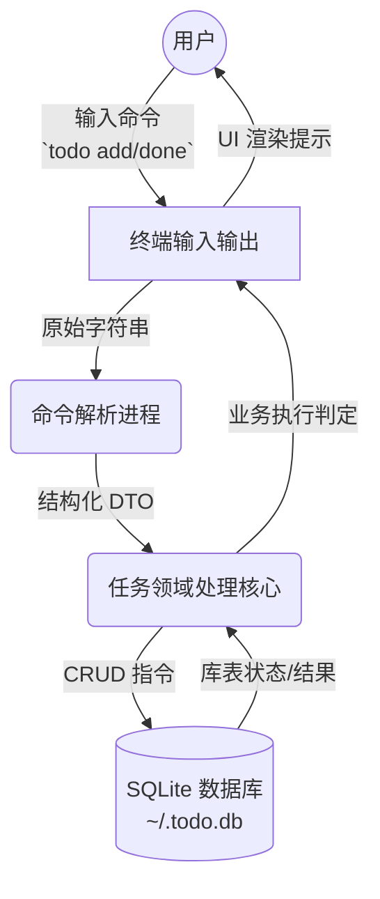
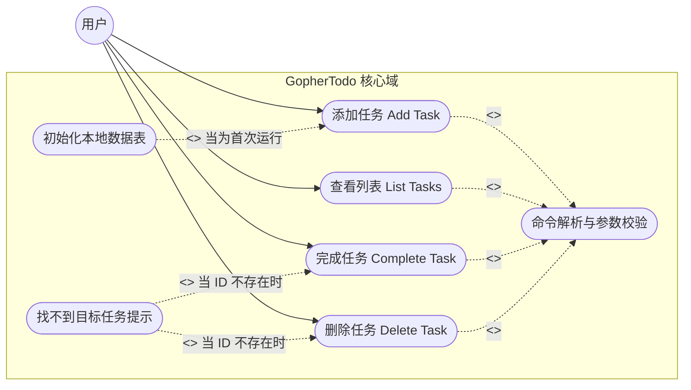
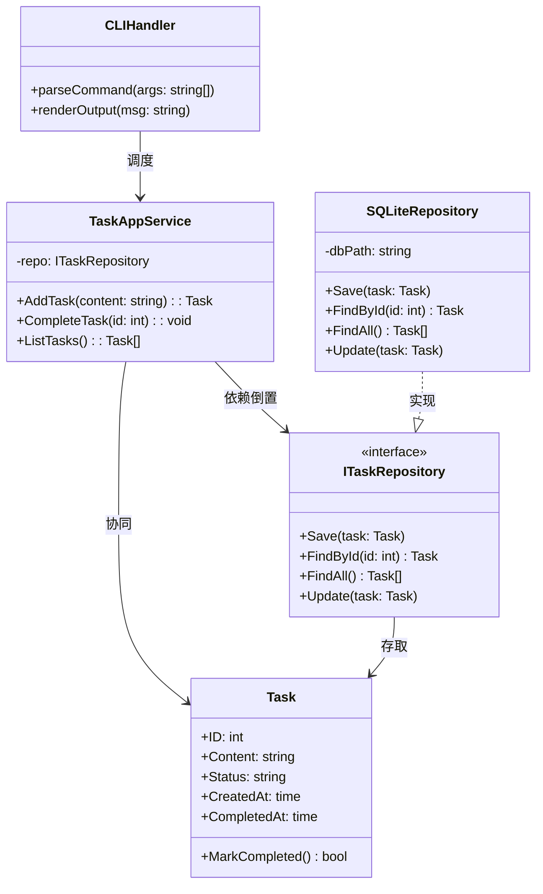
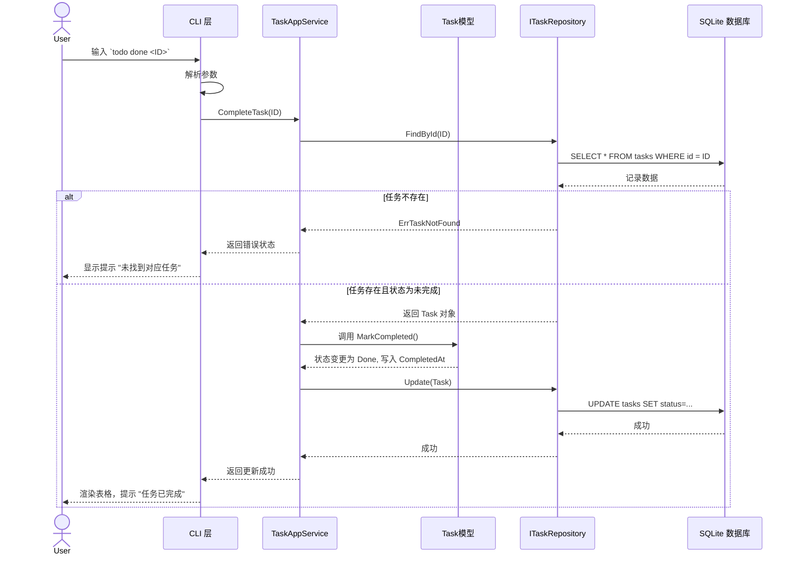

# Sprint 2 OOA 建模评审与重构行动报告

---

## 一、 Sprint 2 团队分工

在本次 OOA 建模评审及后续重构代码落地中，各成员的具体职责分工如下：

| 姓名 | 角色 | 职责分工 |
| --- | --- | --- |
| **陆永祥** | 产品负责人 | 规划重构后的命令交互规范，负责绘制与评审**核心用例图 (Use Case)** 和 **系统数据流图 (DFD)**，确保重构不影响原有用户故事的验收标准。 |
| **邓枭** | Scrum Master | 主持 OOA 建模评审会议，确保团队进度；负责绘制**动态顺序图与全局类图**，推进敏捷开发流程的落地。 |
| **马骏** | 开发团队 | 主导深度代码剖析与**架构审查与重构报告**的编写；在 Sprint 2 中运用面向对象基石（封装、多态等）核心落地业务逻辑与持久层的彻底解耦。 |

---

## 二、 系统数据流图 (DFD)

结合传统结构化方法，我们将 GopherTodo 的核心模块数据流向进行了梳理。数据从用户输入终端，流经解析层，再到业务处理层，最后固化为物理层的数据。

---

## 三、 核心用例图 (Use Case)

基于 GopherTodo 的领域边界绘制了面向对象的任务用例图，明确区分了主干行为（`<<include>>`）和扩展行为（`<<extend>>`）。

---

## 四、 动态顺序图与全局类图

### 1. 全局类图 (静态结构)
经由 AI 逆向梳理的现有代码现状和期望改造后的类结构模型（抽象出 AppService 和 Repository）。提取的实体（如 `Task`）高度吻合我们的业务域。

### 2. 动态顺序图 (核心流程：完成任务)
针对 `todo done <id>` 或者“交易结算/状态修改”的流程进行顺序图推演。使用 `Alt` 片段显式绘制查询失败、成功修改的核心分支走向。

---

## 五、 架构审查与重构报告

### 架构对质与现状反思 (坏味道识别)
结合上述 DFD 和 OOA 模型对早期代码结构进行对质，发现在前一个 Sprint 的 MVP 实现中，存在以下典型的**“坏味道”**：
1. **上帝类 (God Class) 与高耦合：** 原有的 `CLIHandler` 包揽了太多的责任（解析输入、校验数据、拼接 SQL、直接和数据库交互并打印结果）。导致控制台逻辑和底层数据操作“深层耦合”，UI 变动极易影响核心业务逻辑。
2. **贫血领域模型：** `Task` 结构体仅仅用于映射数据库字段，缺乏业务行为。状态更替（如完成任务的时间戳生成、校验其是否已完成）分散在命令处理器的各个角落，违反了高内聚的设计原则。
3. **僵化与脆弱性：** 由于直接通过 `sqlite3` API 调用数据库文件，未来如需做跨设备同步、引入 TUI/GUI 面板或是做自动化的单元测试将步履维艰。

### Sprint 2 解耦重构落地核心方案
在接下来的 Sprint 2 冲刺中，团队计划运用**面向对象的三大基石**进行破局解耦：

1. **利用“封装”(Encapsulation) 充血领域模型：**
   我们要将业务不一致性的风险降到最低。在 `Task` 实体中封装方法如 `MarkCompleted()`，让该模型自身管理内部的 `Status` 和 `CompletedAt` 字段，杜绝直接在外部强行修改变量，从而保障业务约束。
2. **利用“多态”(Polymorphism) 分离持久化依赖：**
   通过提炼 `ITaskRepository` 接口，断开强依赖路径。让核心引擎 `TaskAppService` 针对接口编程即可。这意味着在自动单元测试里，我们可以用内存结构实现 `MemoryRepository` 完美顶替 `SQLiteRepository`，大幅度提升测试覆盖率与开发爽快感。
3. **依赖倒置与分层：** 
   切断从 CLI 向数据库层面的直线单穿耦合。构建清晰的界限：“输入/展示控制 -> 应用服务分发 -> 数据存取接口”。彻底终结 `CLIHandler` 作为“上帝类”的现状，保障架构的伸缩演进。