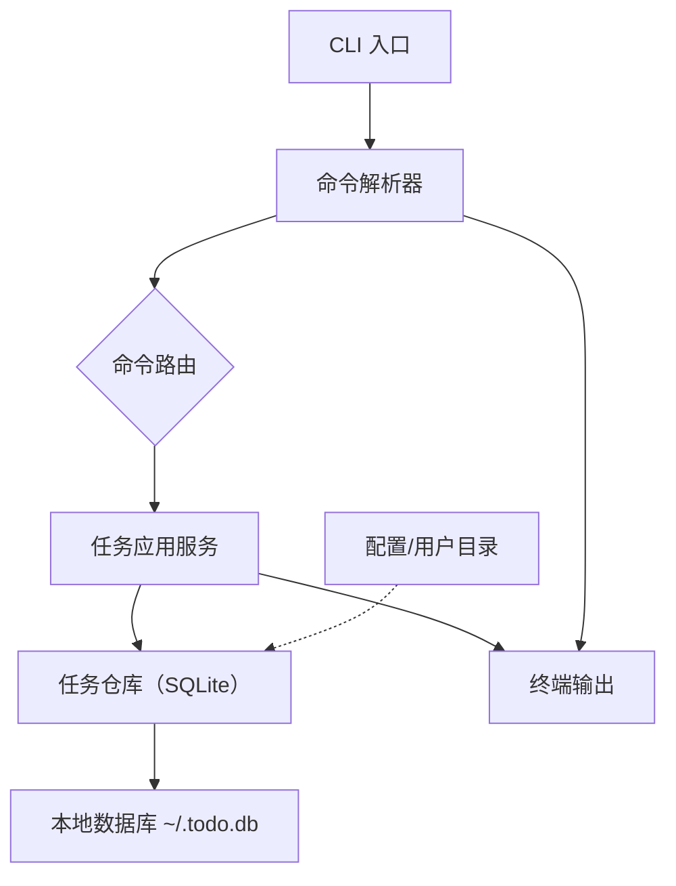

# 理想架构蓝图

## 架构原则
- 采用高内聚、低耦合的分层设计：CLI、应用服务、领域模型和持久层各司其职。
- 每个命令都通过中心应用服务调度，变更只需在一处调整即可保持一致性。
- 将配置、平台特性和外部交互抽象到独立模块以保证测试可控。

## 核心模块说明
1. **CLI 入口与解析**：`todo add/list/done/delete` 直接映射到具体处理器，解析用户输入并构建内部 DTO。
2. **命令处理服务**：单一应用服务如 `TaskAppService` 提供 `CreateTask、ListTasks、CompleteTask、RemoveTask`，它们内部调用领域模型与仓库。
3. **领域模型**：`Task` 聚合拥有 `Content`、`Status`、`CreatedAt`、`CompletedAt` 等字段，并对业务规则（例如只能对未完成任务标记完成或删除）负责。
4. **仓库与持久层**：`TaskRepository` 依赖于 SQLite（`~/.todo.db`），实现 CRUD，并封装事务与路径选择逻辑；配置模块提供用户目录以保证跨平台兼容。
5. **输出与反馈**：`Presenter` 统一拼接表格/提示（例如 `todo list` 的 ID+状态+内容），可抽象为终端视图接口以便未来替换为 TUI/WEB。

## 数据流与交互

## 运维与扩展建议
- 所有攻击面（如路径、ID 输入）提前在应用服务层校验，减少仓库对异常的处理压力。
- 日志与指标可以通过中间件插入 `TaskAppService`，并在未来添加同步/备份适配器时保持命令接口稳定。
- 保持命令与业务规则之间的映射稳定，例如 `todo done 5` 永远走 `CompleteTask`，便于自动化脚本接入。
