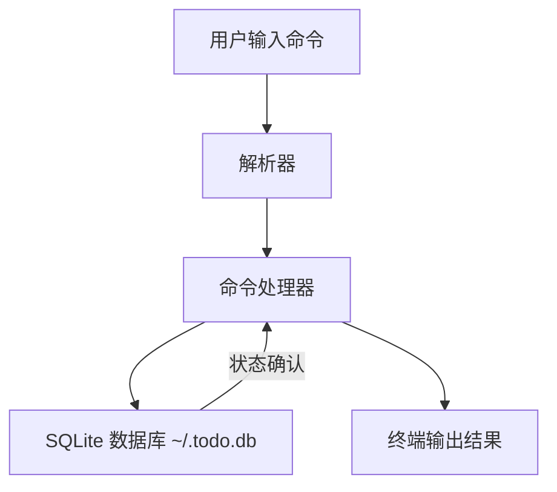

# 简化流程图

本项目是课内简单的 CLI Todo：每个命令直接处理本地任务数据库，调用链如下。下面列出常用命令的处理流：

流程说明：
- `todo add "<内容>"`：解析器识别 add 操作并传递任务内容，处理器将新记录写入数据库并输出成功提示。
- `todo list`：解析器识别 list，处理器从数据库读取未完成任务清单，并以表格形式输出。
- `todo complete <id>`：解析器识别 complete 命令与 ID，经处理器更新对应记录状态并打印确认。
- `todo delete <id>`：解析器识别 delete 命令与 ID，处理器删除或标记删除记录，更新数据库后反馈结果。
