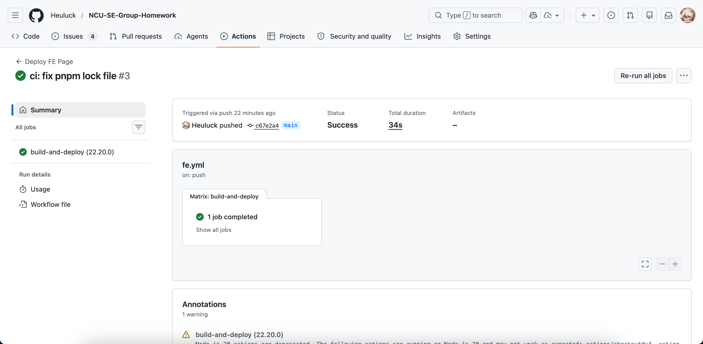
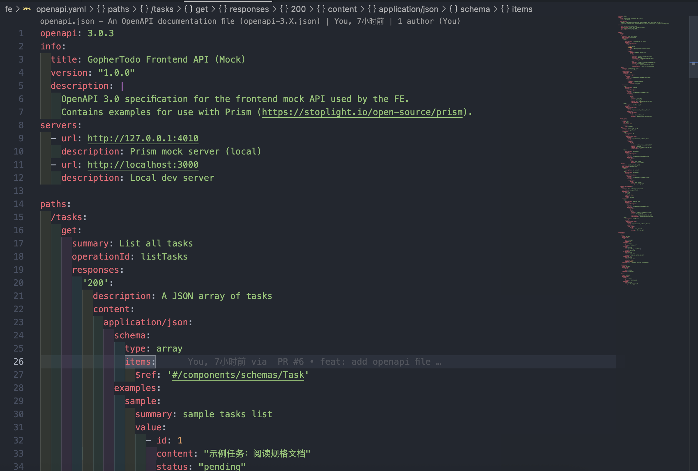
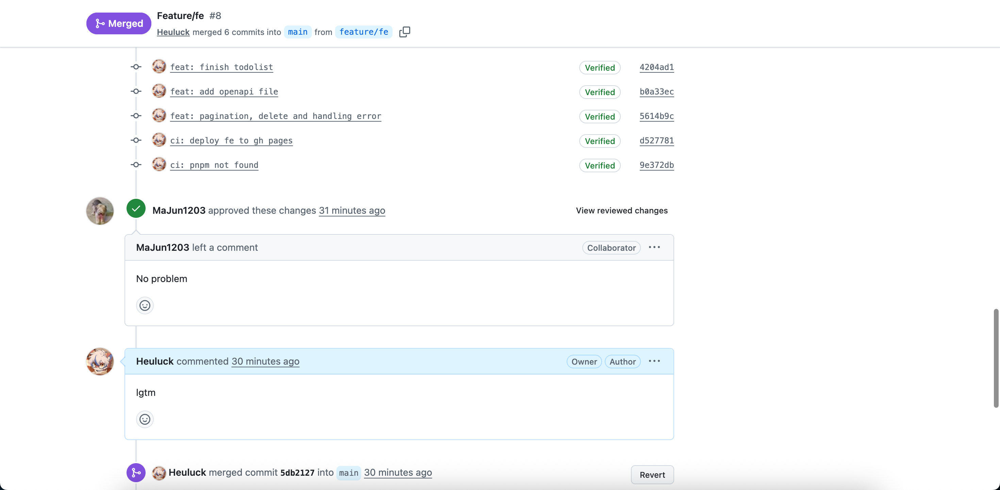
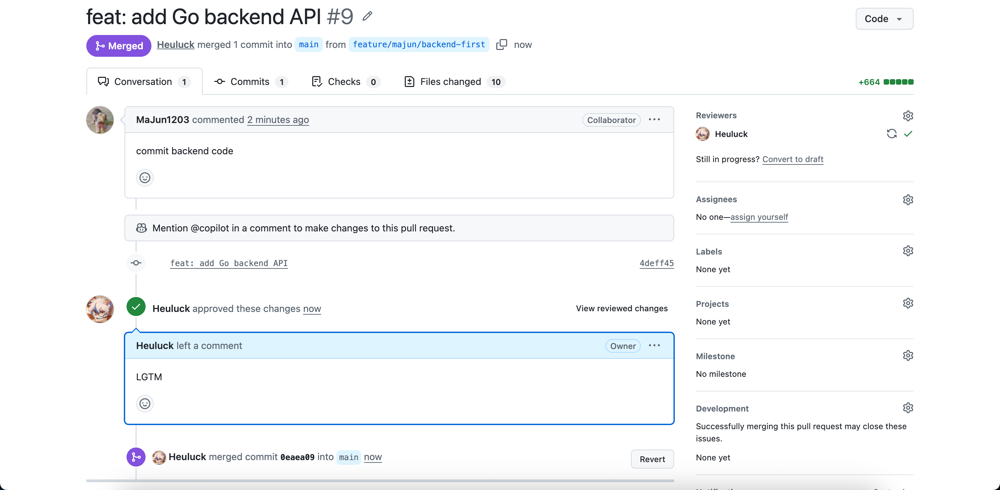
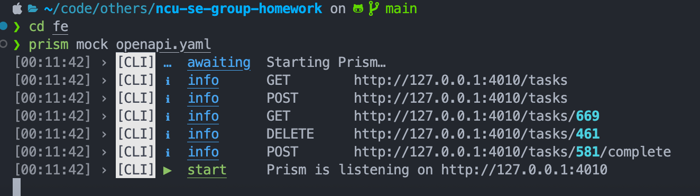

# 第六周作业报告

## 1. GitHub Actions 自动化流水线配置

- 当前仓库有 `.github/workflows/fe.yml`，实现了自动化构建流程。
- 流水线包含：`actions/checkout@v4`、`actions/setup-node@v4`、`pnpm install`、`pnpm build`，并在构建成功后部署前端到 `fe-gh-pages` 分支。
- `main` 分支当前是主干，自动构建已覆盖前端发布路径。

## 2. OpenAPI (Swagger) 接口契约归档

- 已提交契约文件 `fe/openapi.yaml`。
- 合约定义了任务管理的全量业务接口：
  - `GET /tasks`：任务列表查询
  - `POST /tasks`：新增任务
  - `GET /tasks/{id}`：查看任务详情
  - `DELETE /tasks/{id}`：删除任务
  - `POST /tasks/{id}/complete`：标记任务完成
- 文档兼顾请求参数、响应结构、示例数据和错误响应，适合作为 Prism Mock、前后端联调和后续接口对齐的“法定依据”。

## 3. Git Flow 规范化分支治理

- 代码库存在 `feature/fe`、`feat/majun/third_work` 等 feature 分支，符合独立 feature 分支开发规范。

## 4. Mock 环境下的展现层逻辑闭环

- `fe/package.json` 包含 Prism Mock 脚本：
  - `pnpm mock` → `prism mock openapi.yaml -h 0.0.0.0 -p 4010`
- `fe/app/lib/api.ts` 在开发环境中默认使用 `http://127.0.0.1:4010` 作为 API 基址，直接对接 Prism Mock 服务。
- `fe/app/components/TasksPanel.tsx` 实现了核心业务页面逻辑闭环：
  - 任务列表加载与刷新
  - 任务新增
  - 任务完成
  - 任务删除
  - 状态过滤
  - 分页显示
  - 错误提示与用户反馈
- `fe/tests/TaskFilter.test.tsx` 已覆盖页面过滤组件的基础渲染行为。
